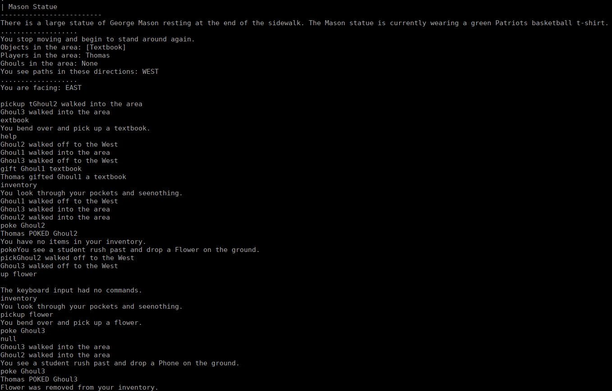
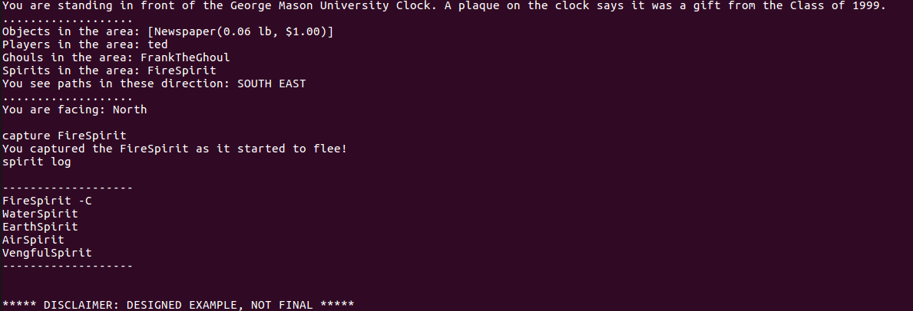
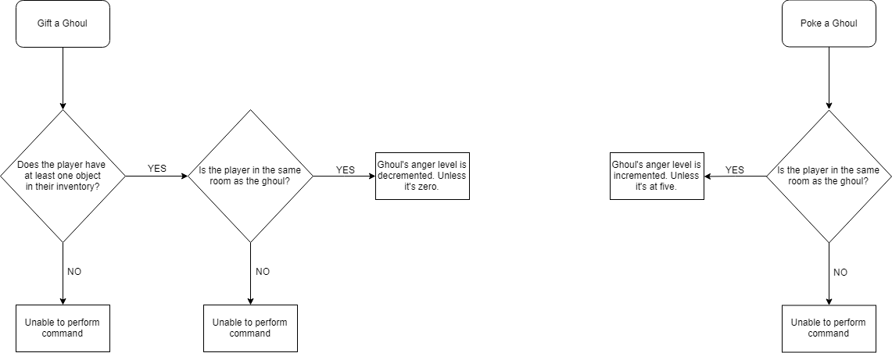
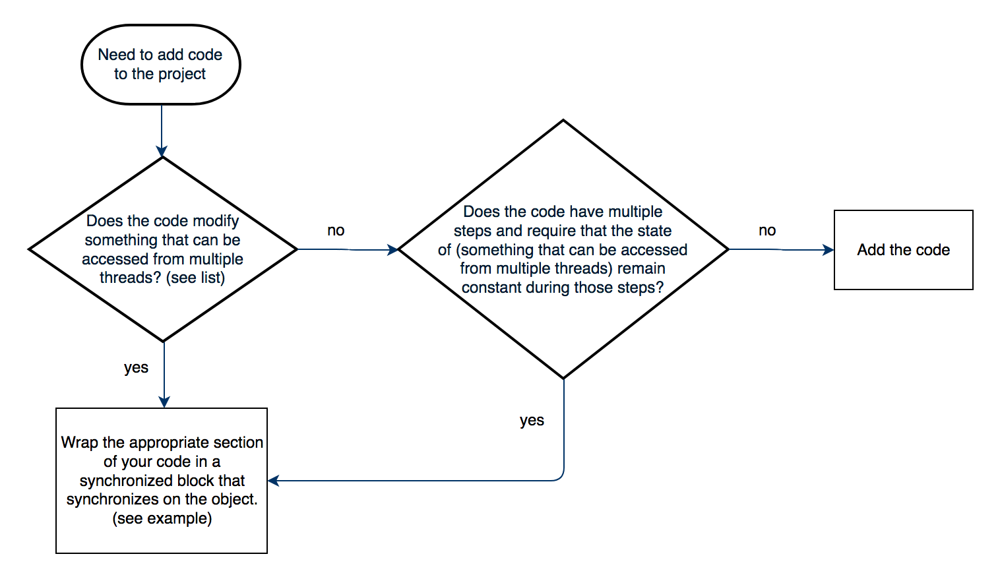

# Users

## Ghosts

The purpose of Ghosts is to add flavor text, text that's unrelated to the rules or gameplay, and random events to the world the player is in. The addition of the Ghosts creates a more immersive and unique world for each individual player and also provides entertainment while they play the game. The Ghosts roam around the map and appear in random rooms. When players enter a certain room, the Ghosts will periodically say funny or scary messages in the chat in the current room that they are located in. This will be seen by the users currently in the same room as the Ghosts saying those certain phrases. The phrases said by the Ghosts will be random and will be said in the chat at random times too.

The user cannot interact with the Ghosts. The Ghosts are simply decorations in the game to make the game more interesting for the user.

Here is a preview of what a ghost might say:


## Ghouls

The purpose of Ghouls to provide dynamic events and interactions to the world. Ghouls are a type
of NPC (non-playable character) that any player can interact with. At the start of the game, several ghouls will spawn into the world, "wandering around"
different rooms in given time intervals.

The player can interact with the ghoul with the "pokeGhoul" command. This allows the player to poke the Ghoul, causing the Ghoul's aggravation to rise. The player and the ghoul must be in the same room for this interaction to happen. The ghoul keeps track of the player's current aggravation until the player leaves the server. If the player pokes the ghoul too many times, the ghoul will "drag" the player back to the the starting room, removing a random item from the player's inventory.

The player can also give an item to the ghoul with the "giftGhoul" command. This causes the Ghoul's current anger with the player to decrease. The player must be in the same room with the ghoul and have at least one item in their inventory to perform this command.

Here is an example of how a player can interact with a ghoul:


## Spirits

The purpose of Spirits is to search for them throughout the map, and once found, the Spirits can be captured. They are a collectible for the world to give the player more activities to do. There are twenty unique Spirit types for the player to collect. Different Spirit types spawn randomly throughout the world and move around, occasionally shifting in and out of reality. The Spirits are supposed to be a hard collectible to catch, so it becomes a challenge capturing them all.

The player may capture the Spirits, using the “capture” command. The player has a checklist of Spirits. If a new Spirit type is captured, and the type is not crossed off on the list, the list will automatically update when the new Spirit type is captured.

The Spirit checklist may be displayed with the command, “spirit log”. Any type already captured will end each line with a “-C”.

Here is an example of how the Spirit might work:


# Developers

## Ghouls - Thomas Washington

Written by: Habib Khalid

Ghouls are phantom like beings that roam around in the game. The ghouls class in Java extends the Non-Playable Character (NPC) class, this means that the ghouls class inherits all the variables, constructors, and methods from the NPC class since ghouls are a type of a NPC.

Ghouls have an aggression system set in the ghoul object. The ghouls anger level can increase, maximum anger level is five and decrease, minimum anger level is zero, based on a player’s actions towards the ghoul. If a player pokes a ghoul then the ghoul’s anger level increments and if a player gifts a ghoul an object from their inventory then the ghoul’s anger level decrements. Keep in mind, a player must be in the same room as the ghoul to poke and gift the ghoul, the player also must have at least one object to gift the ghoul or else the player does not have anything to gift. There are already methods set in place for the ghoul’s class’s aggression system.



## NPC System

The NPCs in the game are all decendants of the abstract NPC class. This class provides basic functionality such as the ability to move randomly throughout the world, the required interface to perform certain actions automatically on a specified time interval, as well as other basic functionality.

The NPCs get activated in a continuous loop on the npcThread in GameCore, constantly calling the tryAi() method on every NPC. This method checks if it is time for that NPC to perform some AI action(s), and if so, calls the doAi() method on that NPC. If it is not time for that NPC to perform some ai action(s), the cycle of tryAi() calls continues.

The default doAi() implementation is simply to call the given moveRandomly() method, which moves the NPC to a random adjacent room in the world. This method, as well as tryAi(), can be overridden to allow any AI actions or timing schedules to be implemented. The only requirement is that tryAi() is the entrypoint to the AI actions, as that is what is called from the npcThread.

#### Synchronization

Due to the existence of multiple threads (npcThread as well as the players' calls to gameCore) changing objects in the game, proper synchronization is necessary to prevent race conditions and bugs from appearing. How we deal with this is by using Java's built in synchronization blocks that will lock an object or class when necessary.

Here is a simple set of guidelines to determine if you should lock on an object before messing with it:


Objects that can be modified by the npcThread:
 * Player objects
 * NPC objects
 * The npcSet object in GameCore.java

Example synchronization block use: 
```java
//in abstract class NPC

  // Instance method that moves this NPC to a randomly selected adjacent room.
  protected void moveRandomly() {

    // Synchronize on this NPC object. The thread will block (wait) on this line until its turn,
    // when it will have exclusive access over this object and execute the code block.
    synchronized (this) {

      // This is included in the synchronized block because once exit is initialized,
      // it must remain accurate for the duration of the moveRandomly steps.
      Exit exit = gameCore.getMap().findRoom(currentRoom).randomValidExit(); 

      broadcast(name + " walked off to the " + exit.getDirection());

      // setCurrentRoom is an instance method that modifies the current room state of this NPC object.
      // This must obviously be in the synchronized block. However, one important note is that 
      // for completeness, the implementation of setCurrentRoom also includes a synchronized (this) block.
      // This might seem like a problem if you think that both methods can't have a lock on
      // this NPC object at the same time, and would result in a deadlock. But this is not the case,
      // because the lock is a ReentrantLock (technical term, look it up for more info) which
      // will detect that it is the same thread trying to acquire the lock on this object,
      // and let the thread proceed because it already has the lock.
      setCurrentRoom(exit.getRoom());

      broadcast(name + " walked into the area");
    }
  }
```
